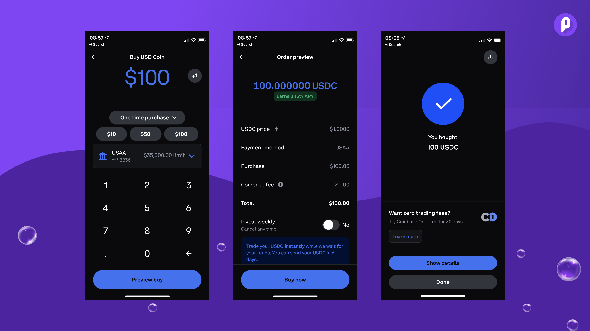
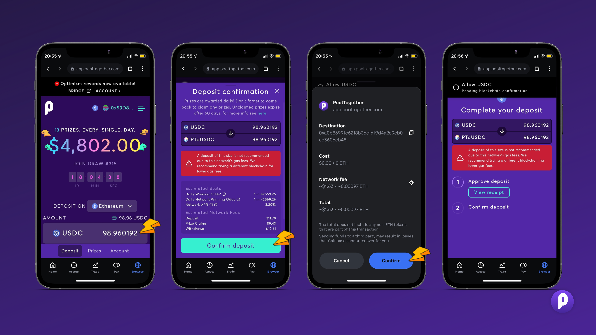

# Using PoolTogether via Coinbase App

Coinbase makes it easy to buy assets with fiat and access Decentralized Finance all within one mobile app. If you haven’t already, you can download the Coinbase app here: \
[Apple](https://itunes.apple.com/us/app/coinbase-bitcoin-wallet/id886427730)⎟[Android](https://play.google.com/store/apps/details?id=com.coinbase.android)

### Activating your dApp Wallet

Before using it for the first time, you’ll need to activate your dApp wallet in order to interact with DeFi applications. But no worries — that’s 2 clicks!

1. Open the **Browser** on the bottom menu of your screen
2. A pop-up will appear introducing the dApp browser
3. Select **Continue**, review the terms, and select "**Agree and get started**"

#### Funding your dApp wallet

To fund your dApp wallet from your existing Coinbase account, open the **Assets** page at the bottom menu of the Coinbase app.

1. Click on the **wallets** tab at the top of the app and select your dApp wallet
2. Select **Add ETH**
3. Select **Transfer within Coinbase**&#x20;
4. Enter the ETH amount you wish to transfer and hit **Preview transfer**
5. Review the details and select **Transfer now**

[Follow this link for a more detailed guide in the Coinbase Help Center.](https://help.coinbase.com/en/dapps/getting-started/using-my-dapp-wallet)

### Getting USDC

In order to use PoolTogether, you need USDC (and a little bit of ETH for the transaction fees). Coinbase allows you to get both without additional fees and deposit directly into PoolTogether without even leaving the app.

1. Head to **Trade** at the bottom of your screen & select USDC
2. Enter the USDC amount, choose your payment method and tap on **Preview buy**
3. Validate your purchase and tap on **Buy now**

<figure><figcaption></figcaption></figure>


_Reminder: Apart from USDC you will need a bit of ETH to cover the transaction fees on the Ethereum network._


## Depositing into PoolTogether via Coinbase

Open the Coinbase dApp browser located at the bottom right of your app and find PoolTogether on the Earn tab or by using the search.

From here, making a deposit only takes three simple steps:

1. Enter the deposit amount & tap on **Review**
2. Approve the USDC tokens
3. Confirm your deposit

<figure><figcaption></figcaption></figure>

 

<figure><figcaption></figcaption></figure>

Now you’re all set for saving and winning prizes. Prize draws happen daily and you can come back whenever you want to [check for prizes](https://app.pooltogether.com/prizes).

You stay eligible to win as long as you are deposited. If you ever want to stop saving with PoolTogether you can withdraw your USDC and all accrued prizes from the [account tab in the app](https://app.pooltogether.com/account).

### Limitations

1. This feature has been rolled out in >90 countries. EU & UK users still have to be patient a little longer.
2. This is currently only available for Ethereum so it makes sense for larger depositors. We anticipate it will be available for other networks very soon.
