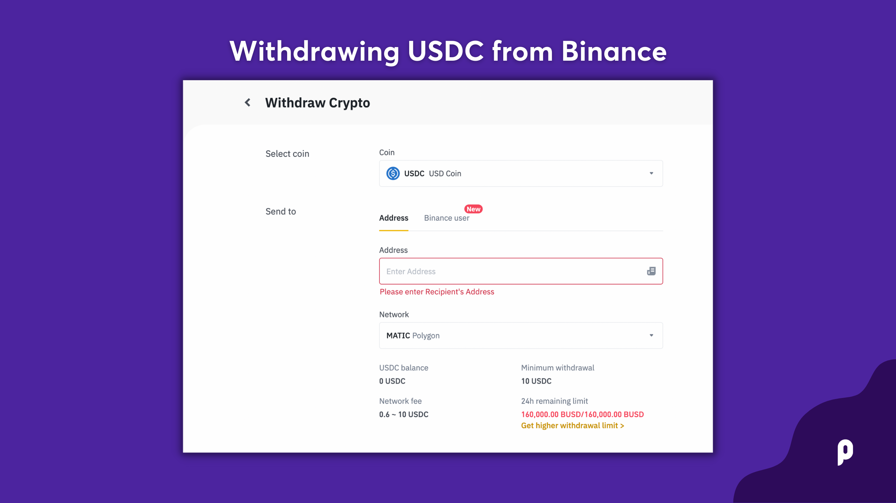

# Withdrawing USDC from Binance

Binance is a Centralized Exchange (CEX) where you can buy tokens using multiple fiat currencies in various payment methods. To purchase cryptocurrencies on Binance, you must first complete their Identity Verification and 2 Factor Authentification process.&#x20;

### Withdraw USDC to Polygon

**Step 1**: On the [Binance](https://www.binance.com/) home page, navigate to **Wallet** -> **Overview**&#x20;

**Step 2**: Click [**Withdraw**](https://www.binance.com/en/my/wallet/account/main/withdrawal/crypto/USDC) on the top left**.**&#x20;

**Step 3**: Fill in the information as stated below.


If you input the wrong information or select the wrong network when making a transfer, your assets will be permanently lost. Please, make sure that the data is correct before making a transfer.


**Select coin:** Select USDC

**Send to**: Paste your Polygon wallet address into the Address field and select **`MATIC`**` ``Polygon` as Network

**Withdraw Amount**: Enter the withdrawal amount. You will be able to see the corresponding transaction fee and the final amount you receive.&#x20;

**Step 4**: Click **Withdraw** to proceed.

**Step 5**: You need to verify the transaction. Please follow the on-screen instructions.


**NOTE**: Binance will deduct a fee for the withdrawal.


Done! You have now withdrawn $USDC from Binance to Metamask. Your assets will arrive in your wallet shortly, ready for [use in the PoolTogether App](../using-pooltogether/).
