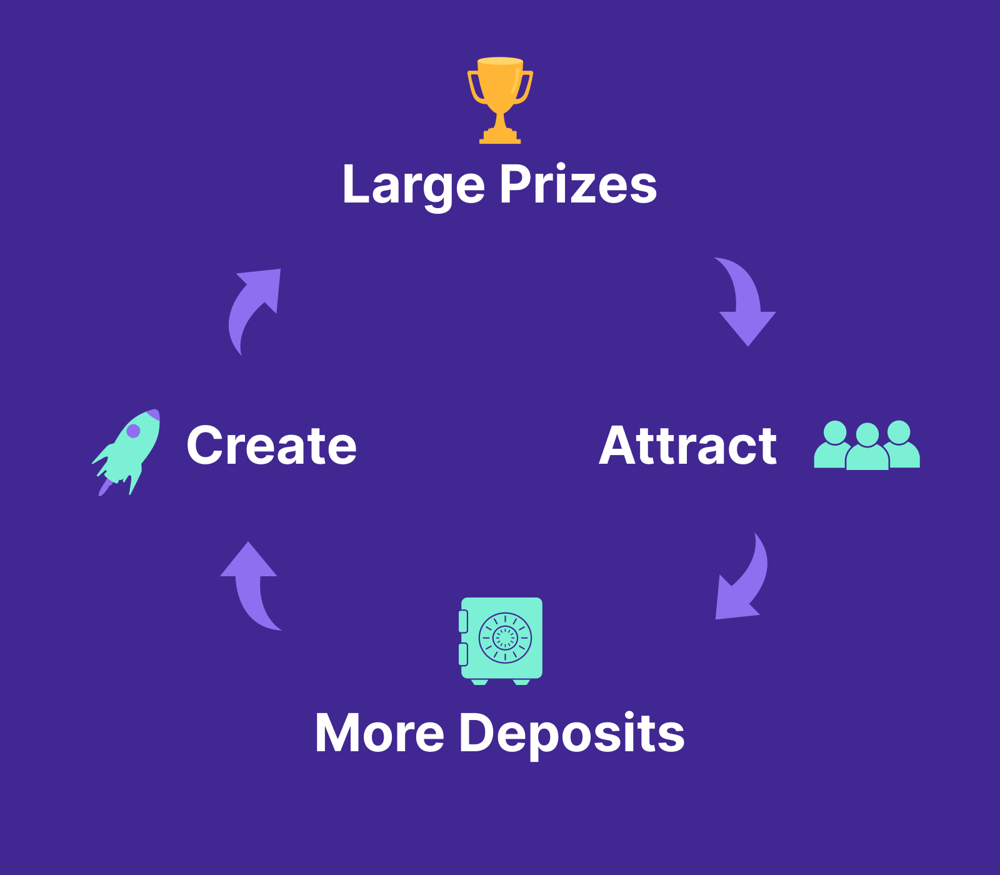

# Tokenomics

## Growth Flywheel&#x20;

The key to PoolTogether's growth and long term sustainability is large prizes. Large prizes attract more deposits which create bigger prizes attracting more deposits. This is the growth flywheel for PoolTogether.

The PoolTogether protocol will reach escape velocity when&#x20;

1\) Prizes are large enough to organically attract new depositors and&#x20;

2\) depositor consistently win enough small prizes to remain engaged and economically better off than a traditional savings account.&#x20;

However, the protocol has a "cold start" problem. Large prizes are needed to get deposits but to get deposits we first must have large prizes. Two mechanisms help overcome this, reserve capture and POOL token distribution.&#x20;

## The POOL Token & Kickstarting the Growth Flywheel&#x20;

The POOL token solves the cold start problem. At the early stages, the distribution of the POOL token serves as an additional incentive to deposit into the protocol when prizes are not yet large enough to achieve escape velocity. People initially deposit primarily to receive the POOL token but these deposits create larger prizes and grow the reserve. Larger prizes begin to trigger organic growth. As organic growth increases and becomes self-sustaining the distribution of the POOL token can be reduced.&#x20;

## Reserve Capture & Perpetual Growth&#x20;

The "Reserve" is a percent of every prize that is kept in the prize pool and placed under the control of POOL token holders.  Funds directed to the reserve make the prizes larger without diluting the odds of winning. Prizes in turn contribute to a larger reserve. This creates a [perpetual growth cycle](https://medium.com/pooltogether/perpetual-growth-db101a47791) and mathematically speaking, increases the expected value of a deposit into PoolTogether. A large reserve accelerates the growth flywheel.&#x20;

&#x20;[You can view the current protocol reserves here](https://info.pooltogether.com/).&#x20;

## Staking POOL

POOL holders can deposit their POOL tokens to enable voting without transactions fees. [Deposit your POOL tokens here to begin](https://app.pooltogether.com/account).

## Governance and the Growth Flywheel&#x20;

The above is the playbook for how the protocol can create self-sustaining organic growth. It's up to POOL holders to manage the different variables properly to ensure this growth happens.&#x20;

